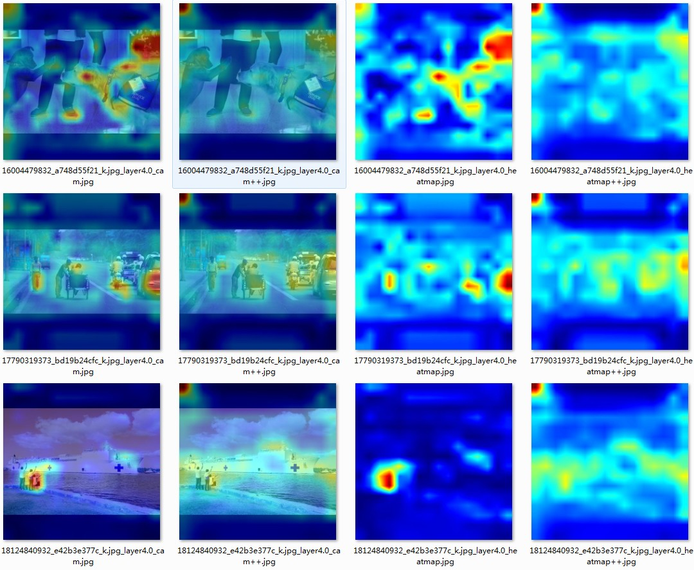
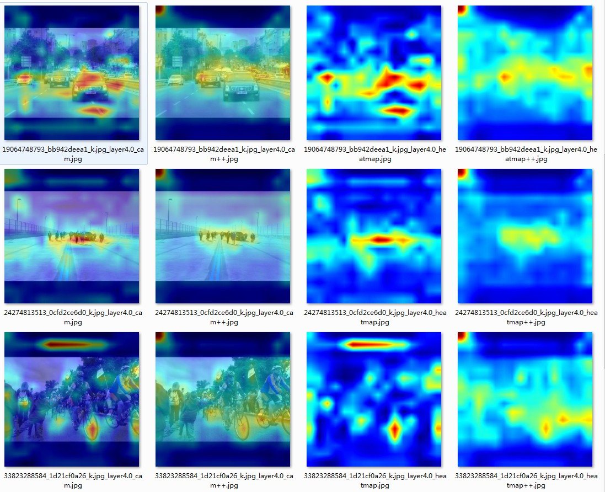
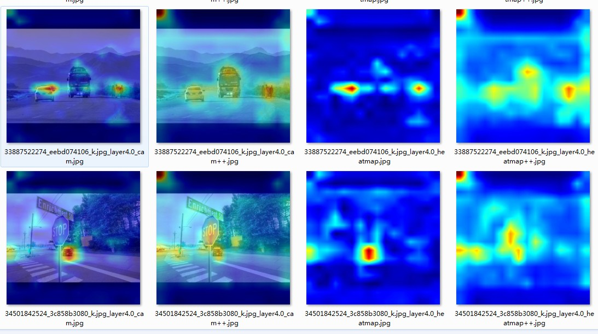

# CenterNet Grad-CAM/++

Show cam for CenterNet, support task ctdet.

# Thanks

https://github.com/xingyizhou/CenterNet  
https://github.com/jinfagang/DCNv2_latest  
https://github.com/yizt/Grad-CAM.pytorch

# Prepare

1. Install Pytorch 1.9
2. git clone https://github.com/JasperMorrison/CenterNet -b grad_cam
3. cd src/lib/models/networks/DCNv2/;rm DCNv2 -rf;
4. git clone https://github.com/jinfagang/DCNv2_latest DCNv2
5. cd DCNv2; vi make.sh; remove the sudo cmd prefix
6. ./make.sh
7. Download CenterNet pretrained model (refs to branch master);

# Set hook layers

Add layer name to self.cam_layers in base_detector.py

```
    self.cam_layers = [
      # "conv1",
      # "layer1.0.conv1",
      # "layer2.0",
      # "layer3.0",
      "layer4.0",
      # "layer4.0.conv1",
      # "layer4.0.conv2",
      # "layer4.1",
      # "deconv_layers.15",
      # "hm.0", #set inplace=True as inplace=False in the model py
    ]
```

# Example

1. cd src
2. python demo.py ctdet --demo ./images/ --load_model ./models/ctdet_coco_resdcn18.pth --arch resdcn_18 --grad_cam







